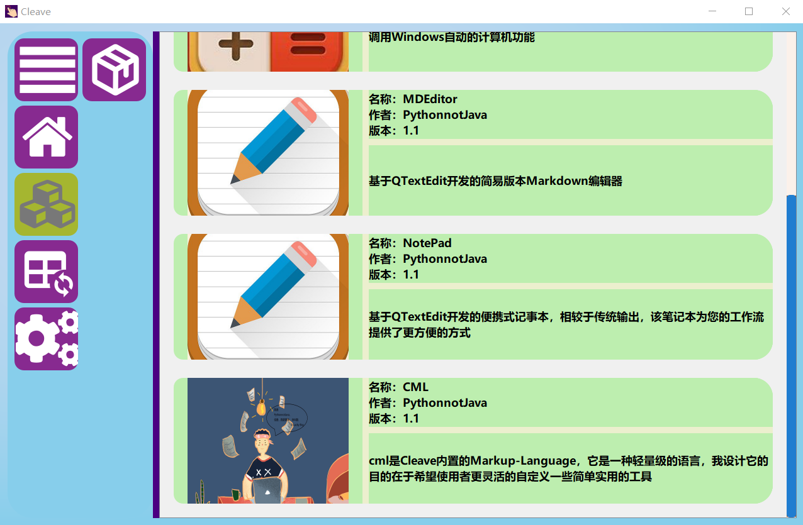
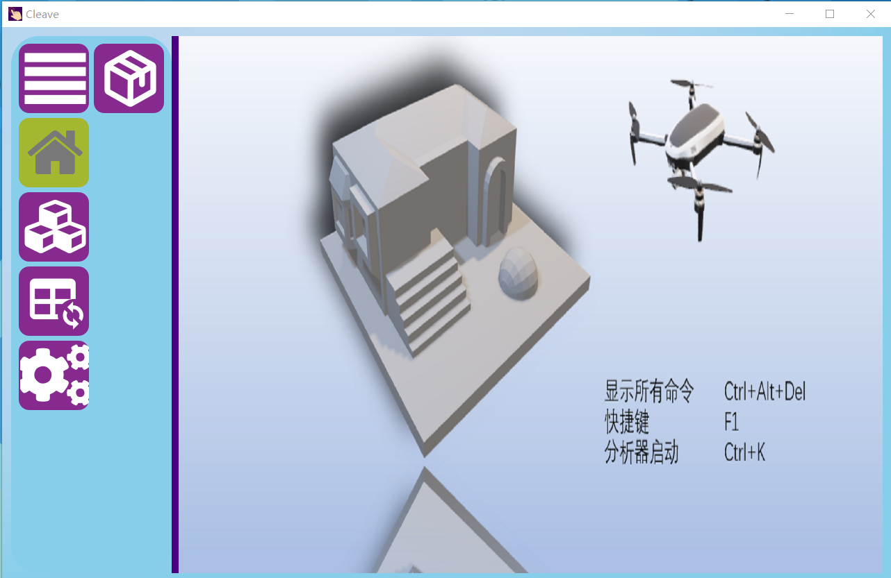
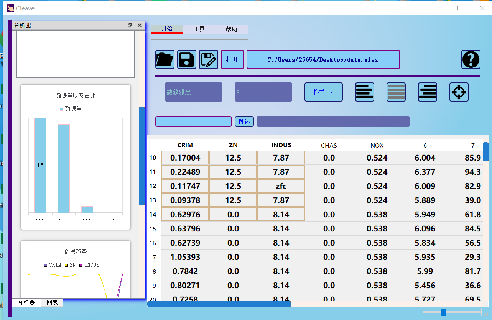
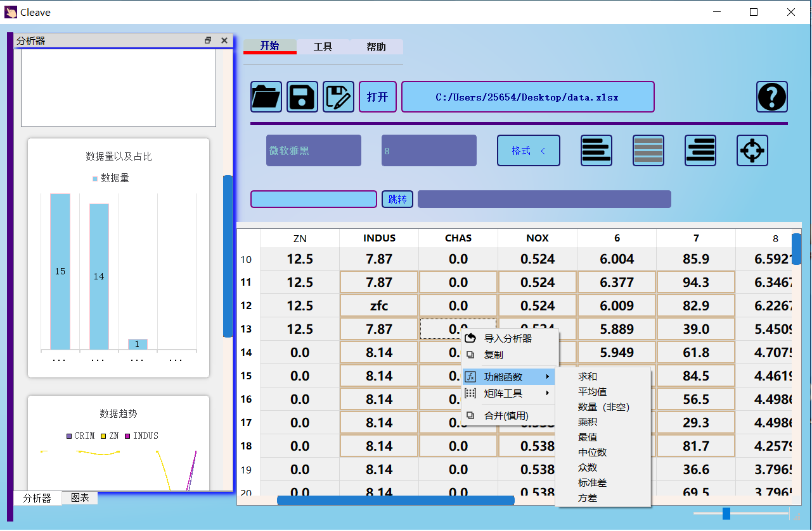

# Cleave
> 关于Cleave：Cleave是一款未设计完成的数据分析为主的软件，本来设计思路是以数据分析和修复以及数据预测为核心

## 文件夹和一些文件的主要作用以及部分未实现功能

### bin
* 放置了主页面
* 更新几种不同启动界面未实现
> Cleave.py：带有启动动画的主界面  
> 
> main.py：主界面

### doc
* 放置帮助文档（未实现）以及快捷键、状态码等一些记录
* 关于状态码：在一些函数完成时打印的标记字符串，为了调试用

### EditorCore
* 为内置的标记语言CML设计的可以自动补全的编辑器（未实现），设计思路是使用QTextEdit（而不是QSci），在拼写的时候，跳出类似菜单栏的代码补全功能
* 关于CML语言请查看该文件夹下的CMLBuilder中的文件，大致思路就是——因为设计好了一些统一接口函数，比如setWidgets以及继承关系，把控件的关系抽象成树，由于设计了一个layoutFactoryConstructor的函数，可以粗糙的将控件布局进去

### ExampleChart
* 是我预想的最终效果，根据模型选择以及数据分析等，最终将生成一个数据面板，可以对数据保存为模型、提供预测等等等

### Face
* 放置侧边栏按钮的链接界面，还有一个启动界面

### ML
* 预计使用机器学习对数据进行修复、预测等

### OptQt
* 封装了一些PyQt5的库并拼凑了一些类型，数据分析的核心也在此
> 关于为什么封装？
> * Qt是典型的命令式编程，用起来很麻烦，往往一个控件的不同功能代码或者一行又一行的代码写在不同的地方，受了一些声明式编程的影响，虽然没实现完美的声明式编程，也算中规中矩，对我当时来说算是够用的了
> * 当时也看了一些PyQt相关的书和视频，学着玩的时候顺手把相关功能写在一起了，便于记忆，算是当笔记本了
---------------------------------------------------------------------------
> AdvancedTools.py：高级工具，可以说是不希望随便摆弄软件设置的功能  
> 
> AnalysisCore.py：数据分析前的预览，这个在ExcelKernel中被调用的时候，会阻塞线程加载，防止大量数据分析导致崩溃，测试的时候注释了
>
> ChartsBoard.py：在进行简要分析后，选择怎么对数据可视化  
> 
> ColorPalette.py：简易的调色板  
> 
> ExcelKernel.py：核心控件，太多功能没完善  
> 
> FunctionBar.py：ExcelKernel的函数栏（跳转、记录矩阵计算等等等），比较早就开发的功能  
> 
> MixinAnimations.py：动画效果控件  
> 
> OptComponent.py：一些早期开发的组合控件  
> 
> OptimizeQt.py：主要封装PyQt的一些控件  
> 
> OptMsgBox.py：本打算配合动画使用的弹出框，主要用于报错/警告才写的，但是出问题了，可以无视
> 
> OptQtCharts.py：本想着像OptimizeQt一样封装一些QtCharts，研前前几天写着玩的，现在一想，真是鸡肋
> 
> OptTableWidget.py：ExcelKernel的表格控件，也算是核心之一
> 
> OptTabs.py：ExcelKernel的导航栏
> 
> QTyping.py：为了方便而实现一些类
> 
> UtilForTestUI.py：测试面板，我想的是该面板可以实时追踪ExcelKernel的状态，进行同步测试

### Orderlines
* 使用Dart写的简易的命令行，当时只写了思路，尚未完成大部分的功能响应

### Plugins
* 插件，当然了，插件功能是我自己实现的，没有实现官方的那个插件类，首先是相关文档太少了，另外，貌似插件需要使用C++Qt编译的dll文件，不会C++，首先就排除了

### SideBar
* 侧边栏按钮
* 我记得我放了一个彩蛋在这里，那个德古拉的tips没写完整

### Sources
* 放置资源文件，不过资源路径用的pathlib声明的，这玩意打包会出问题，我遇到但是没去解决过
* 另外，整体界面的UI配色是很丑的，因为我缺乏艺术细胞吧，我本来打算学学Material那种配色体系的
> 顺便说一下，换了多次logo之后，我选择了源于《魔兽争霸》中“致命一击”作为图标，因为它更有一种斩断的效果（Cleave）

### Util
* 工具包，我想着尽量往UI和功能独立去实现
> common_tools.py：主要放置了ExcelKernel中多单元格运算操作的代码
> 
> dataSets-return-example.json是getOrganizeClassify函数的案例文件
>
> errors.py：本打算自定义一些错误，便于调试或者处理错误
> 
> excelkernel_functions.py与tablewidget_functions.py：这两个文件是ExcelKernel的核心功能文件，一个更偏向ExcelKernel，另一个更偏向OptTableWidget
> 
> matrix_tools.py：主要放置了ExcelKernel中的矩阵工具代码
> 
> orders.py：记录了一些记录……
> 
> plugins_loader.py：插件解析器，请看Plugins文件夹下的插件设计规范
> 
> table_direct_tool_fix_datas.py：本打算和人合作写的基于机器学习的数据预测和修复两个核心功能而设置的文件
> 
> tackle_datas.py：ExcelKernel的导入分析功能函数
>

## 关于特别想设计的一些功能
* 再优化插件系统，然后写个插件操作用的独立面板
* 我在ExcelKernel中放了一个调试面板，可以写入代码，如果使用Python，我想的是，如果能够规定一个函数接口并在解析代码时候检测到，可以对ExcelKernel进行通信
* 正如project.log中写的，有些基于线程的问题仍需要优化
* 如果能在ExcelKernel实现这样一个功能——在单元格操作（合并、冻结等），可以将当前单元格状态像规划表一样导出来一个文件，然后可以反解析回去，这不正是另一个应用了吗
* 设计一套朴素的UI配色
* 细心的查看内存占用，会发现Cleave占用将500MB！很大了，尽量进行一个懒加载等优化

## 为什么选择Python？
* 不会C++
* 想用Dart的Flutter但是Dart库少，而且Dart不如Python好写

#### 希望后来者能做出更多优秀的开源项目

----------------------------------------------------------------------
## 一些展示

#### 备注：后续有空可能还会开发……
