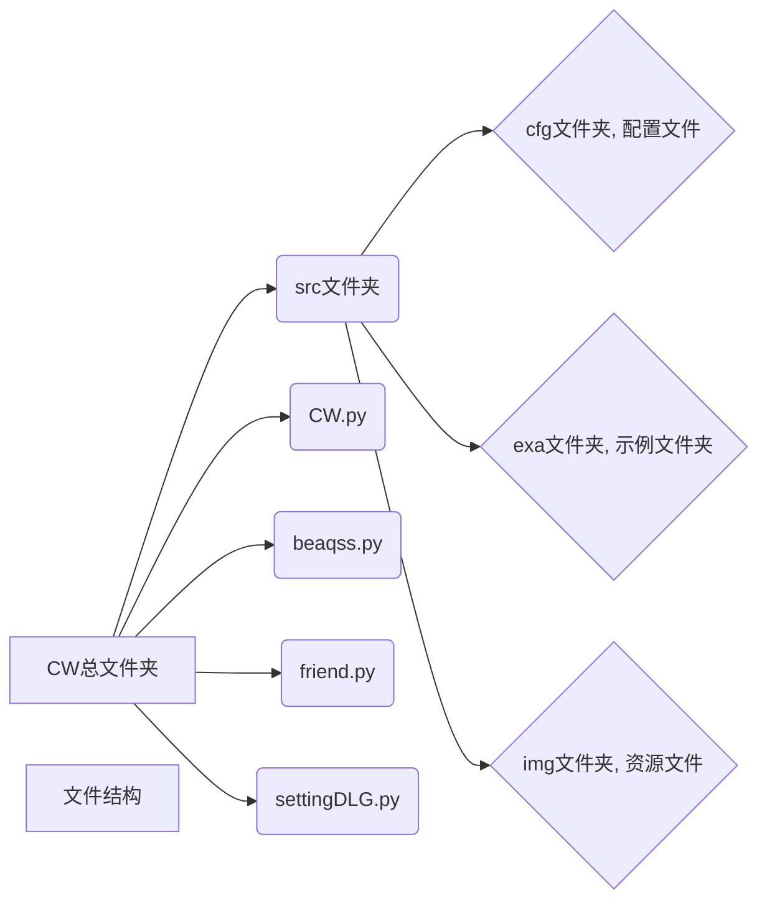

# 从文件结构看

>> ### 美化方案 使用<font color="red">*beaqss.py*</font>的调用，对控件美化，而不是QSS文件
>>
>> ### 主控面板 使用<font color="red">*CW.py*</font>
>>
>> ### <font color="red">*friends.py*</font>是主控面板的大部分功能控件的组成，也包含了一些额外功能函数
>>
>> ### <font color="red">*settingDLG.py*</font>是设置面板，目前只停在了透明度的设置，所以你会在文件里看到一堆alpha相关定义
>>

# topWidget控件的子控件使用说明

## tool1使用说明

注 ： fileope是核心实现方案，点击会出现菜单栏

#### 子控件——fileope

* explainCWMLFile是解释cwml文件的功能，这里我不提供对后缀是cwml文件，但是内容有问题的文件的处理 ```快捷键(Ctrl+Shift+B)```
* saveAS是保存已被编辑的文本，对于未被编辑的文本，会置之不理，这个思想来源于Windows自带的notepad ```快捷键(Ctrl+Shift+N)```

## tool2使用说明

注意 : 目前使用说明文档，其他暂未知

## tool3使用说明

注 ： tool3menu是核心实现方案，点击会出现菜单栏

#### 子控件——tool3menu_menu

* t3_1 _*字体大小设置*_    ```快捷键(Ctrl+Shift+S)```
* t3_2 _*字体颜色设置*_    ```快捷键(Ctrl+Shift+C)```

# textedit控件的子控件使用说明

注意 ： 核心功能在于右键菜单栏

```
self.rightClick = QMenu()
self.rightClick.setStyleSheet(menuqss)
# 功能
self.copy = self.rightClick.addAction('复制')
self.select_all = self.rightClick.addAction('全选')
self.paste = self.rightClick.addAction('粘贴')
self.delete = self.rightClick.addAction('删除')
.........
# 这里是核心功能，功能已经在上面说明了
self.copy.triggered.connect(self._copy)
self.select_all.triggered.connect(self._select_all)
self.paste.triggered.connect(self.__paste)
self.delete.triggered.connect(self._delete)
.........
```

### 功能预览

* 复制全部
* 选择全部
* 粘贴
* 删除全部
* 语音读取
* 期待更多

# buttomWidget控件的子控件使用说明

## setting——设置面板 ```快捷键 ： F2```

* 透明度设置，核心是在初始化时载入了p参数，这个参数代表了主控面板，在getAlpha里实现了透明度设置
* 期待更多

# 额外功能开放说明

* 支持文本文件的拖入读取
* 支持本地图片拖入读取
* 字体设置
* 字体颜色设置
* 背景图片更换，这需要写入目录下setting.json配置文件，然后重新启动软件
* 更多快捷键
