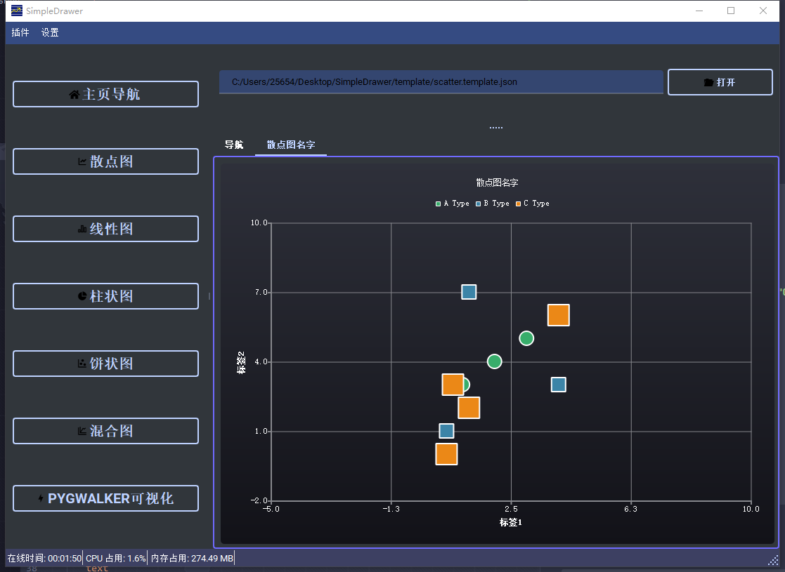
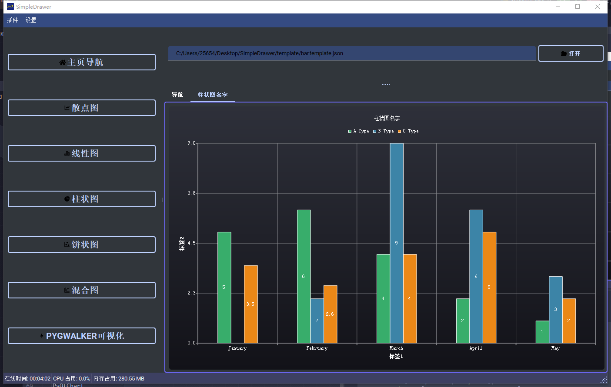
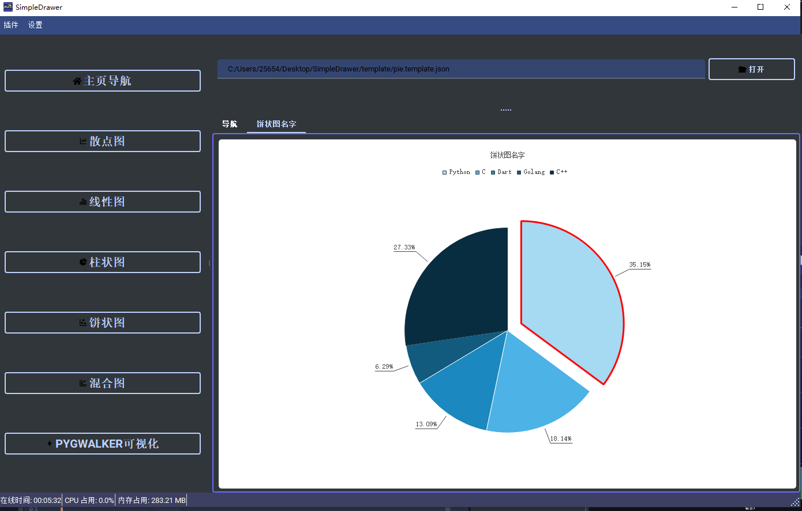
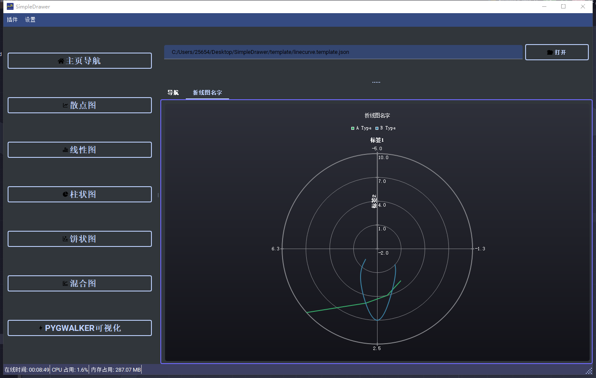
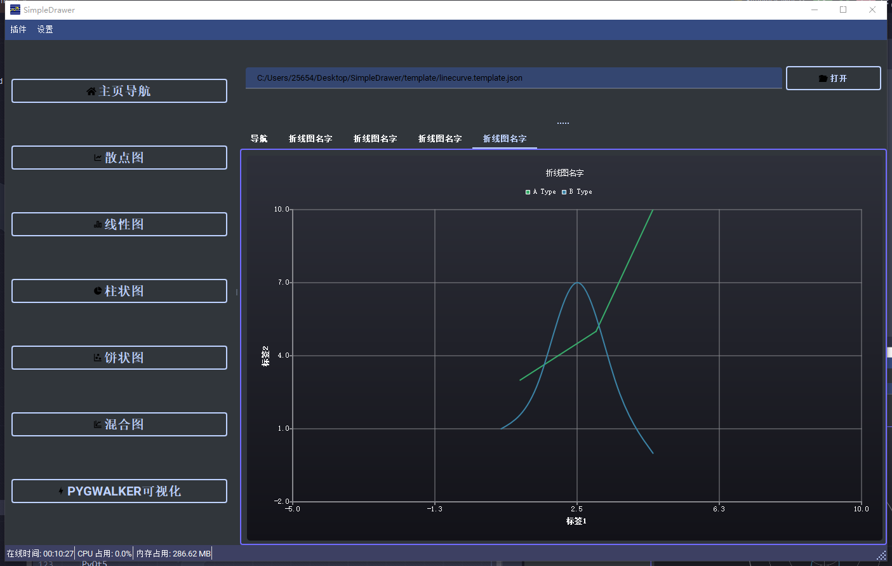

# DCQT
对PyQt5的封装

## SimpleDrawer画图

- 配置一下就能跑
- 支持插件系统
- SimpleDrawer是自由的，你可以想办法注入代码

### 散点图
```json
{
  "title" : "散点图名字",
  "theme" : 2,
  "polar" : false,
  "shape" : ["c", "r", "r"],
  "size" : [20, 20, 30],
  "color" : ["red", "blue", "grey"],
  "categories" : ["A Type", "B Type", "C Type"],
  "xs" : [
    [1, 2, 3, 4],
    [0.5, 0.7, 1.2, 4],
    [0.5, 0.7, 1.2, 4]
  ],
  "ys" : [
    [3, 4, 5, 6],
    [1, 3, 7, 3],
    [0, 3, 2, 6]
  ],
  "xrange" : [-5, 10],
  "yrange" : [-2, 10],
  "xlabel" : "标签1",
  "ylabel" : "标签2"
}
```

---




### 柱状图
```json
{
  "title" : "柱状图名字",
  "theme" : 2,
  "type" : 0,
  "value-visible" : true,
  "default-color" : false,
  "color" : ["tan", "blue", "skyblue"],
  "categories" : ["A Type", "B Type", "C Type"],
  "bw" : 0.5,
  "datas" : [
    [5, 6, 4, 2, 1],
    [0, 2, 9, 6, 3],
    [3.5, 2.6, 4, 5, 2]
  ],
  "rorate" : 0,
  "labels" : ["January", "February", "March", "April", "May"],
  "xlabel" : "标签1",
  "ylabel" : "标签2"
}
```



---

### 饼状图
```json
{
  "title" : "饼状图名字",
  "theme" : 0,
  "default-color" : false,
  "color" : ["red", "blue", "yellow", "tan", "darkcyan"],
  "categories" : ["Python", "C", "Dart", "Golang", "C++"],
  "hole" : 0,
  "format" : 2,
  "datas" : [43.6, 22.5, 16.23, 7.8, 33.9],
  "label-visible" : true,
  "datas-visible" : true,
  "use-percentage" : true
}
```



---

### 极坐标
```json
{
  "title" : "折线图名字",
  "theme" : 2,
  "polar" : true,
  "type" : [0, 1],
  "color" : ["red", "blue"],
  "categories" : ["A Type", "B Type"],
  "lw" : [10, 5],
  "xs" : [
    [1, 2, 3, 4.5],
    [0.5, 1.5, 2.5, 3.5, 4.5]
  ],
  "ys" : [
    [3, 4, 5, 10],
    [1, 3, 7, 3, 0, 6]
  ],
  "xrange" : [-5, 10],
  "yrange" : [-2, 10],
  "xlabel" : "标签1",
  "ylabel" : "标签2"
}
```



---

### 折线图
```json
{
  "title" : "折线图名字",
  "theme" : 2,
  "polar" : false,
  "type" : [0, 1],
  "color" : ["red", "blue"],
  "categories" : ["A Type", "B Type"],
  "lw" : [10, 5],
  "xs" : [
    [1, 2, 3, 4.5],
    [0.5, 1.5, 2.5, 3.5, 4.5]
  ],
  "ys" : [
    [3, 4, 5, 10],
    [1, 3, 7, 3, 0, 6]
  ],
  "xrange" : [-5, 10],
  "yrange" : [-2, 10],
  "xlabel" : "标签1",
  "ylabel" : "标签2"
}
```



---


## 依赖
```text
python >= 3.12
PyQt5
PyQtChart
qt-material
qtawesome
matplotlib
pygwalker
psutil
```

